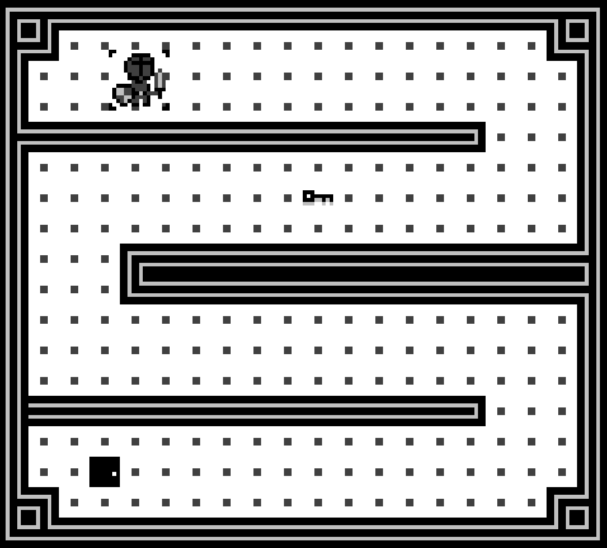

# Tiny Game on Game Boy Classic

## Presentations

This is a tiny game for Game Boy Classic DMG. It's a dungeon crawler where you play a knight fighting monsters to reach a treasure deep in the dungeon.

This game is developed in **assembly codeGBZ80**

## Topics
- Memory management
- Tilemap/Tileset
- Sprites movements

